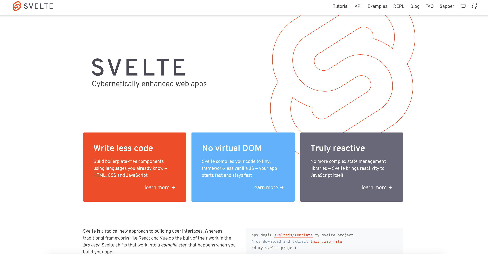

# forif svelte 스터디 자료



## 주차 별 과제 계획

- 1주차: 구글 폰트 사이트 클론 코딩
- 2주차: 디지털/아날로그 타이머 만들기
- 3주차: TODO 리스트 만들기
- 4주차: 하노이의 탑 만들기
- 5주차: 술자리 유형테스트 https://dailyshot-test.firebaseapp.com/

# Svelte 란?


[Svelte(스벨트)](https://svelte.dev/)는 NewYorkTimes의 [Rich Harris](https://twitter.com/rich_harris)가 제작한 새로운 접근 방식을 가지는 프론트엔드 프레임워크로,

2019년 8월에 version3가 공개되었습니다.

Svelte는 자신을 ‘프레임워크가 없는 프레임워크’ 혹은 ‘컴파일러’라고 소개합니다.

version3 가 공개되면서 제대로 이목을 끌게된 프레임워크 이지만 벌써 github star 수가 3만 6천에 이를 정도로, 웹 프론트엔드 세계에서 주목하고 있는 트렌디한 프레임워크입니다.

### 무엇이 svelte 를 이렇게 관심받을 수 있게 한걸까?

svelte 의 등장 이전에 웹 프론트엔드 생태계에는 js frontend framework 삼대장이 존재했습니다.


프론트엔드 삼대장 React, Angluar, Vue 입니다.

그중에서도 Vue 와 React 는

github에서 좀처럼 볼 수 없는 무시무시한 star 수를 보유한 막강한 웹 프론트엔드 프레임워크였습니다.

이들은 각각 2014년, 2013년에 등장하면서 지금까지 수많은 이용자들을 만들어냈었는데요,

svelte는 여러 차별점을 가져가면서 단기간에 급부상했습니다.

svelte의 차별점을 알아보기 앞서 svelte 의 단어 뜻을 살펴보면


Thin, Slim 과 비슷한 의미를 가진다는 것을 알 수 있습니다.

이를 통해 알 수 있듯이 svelte 는 기존의 프레임워크에 비해 가볍고, 빠르다는 것을 장점으로 내세워서 등장했습니다.


입력한 두 값의 합을 출력하는 프로젝트를 예시로 보면 그 차이를 눈으로 확인할 수 있습니다.

### React

```jsx
import React, { useState } from "react";

export default () => {
  const [a, setA] = useState(1);
  const [b, setB] = useState(2);

  function handleChangeA(event) {
    setA(+event.target.value);
  }

  function handleChangeB(event) {
    setB(+event.target.value);
  }

  return (
    <div>
      <input type="number" value={a} onChange={handleChangeA} />
      <input type="number" value={b} onChange={handleChangeB} />

      <p>
        {a} + {b} = {a + b}
      </p>
    </div>
  );
};
```

### Vue

```jsx
<template>
  <div>
    <input type="number" v-model.number="a">
    <input type="number" v-model.number="b">

    <p>{{a}} + {{b}} = {{a + b}}</p>
  </div>
</template>

<script>
  export default {
    data: function() {
      return {
        a: 1,
        b: 2
      };
    }
  };
</script>
```

### svelte

```html
<script>
  let a = 1;
  let b = 2;
</script>

<input type="number" bind:value="{a}" />
<input type="number" bind:value="{b}" />

<p>{a} + {b} = {a + b}</p>
```

이렇게 코드의 양이 줄어드는 것은 코드 가독성을 높이고, SPA에서 번들의 무게를 줄여 첫페이지에 모든 것을 로드해야 하는 SPA 프로젝트에서 효율적입니다.

이후 유지 보수에 있어서도 코드의 절대적인 양이 적다는 사실은 개발자를 더 편하게 만들어주고, 생산성을 늘려줄겁니다.

## 실질적인 성능차이

단순히 코드의 양이 줄어드는 것 만으로는 이렇게 급부상할 이유로는 부족해보입니다.

svelte는 real DOM 을 사용하여 virtual DOM을 사용하는 React, Vue 와 같은 프레임워크와 구조적인 차이를 가지고 있고, 이는 더 좋은 성능으로 이어집니다.


뭐 대충 더 좋다는 뜻의 사진입니다.

이러한 가볍고 빠르다는 장점은 svelte 홈페이지에서도 어필되고 있습니다.

### Truly reactive

앞선 사진에서 보셨겠지만 svelte 의 또 다른 장점은 엄청난 반응성입니다.

React 를 써보신 분이라면 아시겠지만 React의 상태관리(state management)는 정말 귀찮고, 복잡합니다.

이에 비해 svelte는 모든 부분이 reactive 하게 돌아가고, 실제로 반응형으로 작동하는 부분이 어디인지를 알고 있다고 합니다. (솔직히 저도 이건 무슨소린지 잘 모르겠습니다)

아무튼 뭐 그렇다고 합니다.

### 쉽고 빠르게

svelte 는 다른 웹 프레임워크들에 비해서 낮은 러닝커브를 가진 편입니다. 위에서 언급된 짧은 코드, 좋은 반응성이 이를 가능하게 해주죠. 그리고 그냥 HTML을 다루듯이 작성하는 코드 스타일도 한몫 합니다.

낮은 러닝커브로 인해 쉽고 빠르게 배울 수 있고, 빠른 속도로 svelte를 익히면서 배운 프론트엔드 지식과 개념들은, 나중에 Vue와 React같은 다른 프레임워크를 배우더라도 큰 도움이 될 수 있습니다.

해당 내용은 당근마켓의 개발자이신 변규현님의 블로그를 참고했습니다.

[Khbyun's blog](https://novemberde.github.io/javascript/2019/10/11/Svelte-revealjs.html)

# 개발 환경 구성하기

### npm, npx 설치하기

[npm 다운로드 링크](https://nodejs.org/en/)

npm@5.2.0 이상 버전만 깔려 있다면 npx 커맨드를 사용 가능합니다.

### svelte 프로젝트 생성

```bash
cd your/working/dir
npx degit sveltejs/template my-svelte-project
```

### 결과


- **`/public`**에는 Svelte가 수행한 컴파일 결과가 들어갑니다.
- **`/src`**는 모든 사용자 정의 Svelte 코드를 저장합니다.

### svelte 실행

```bash
cd my-svelte-project
npm install
npm run dev
```

ctrl + click 으로 [localhost:5000](http://localhost:5000) 접속
