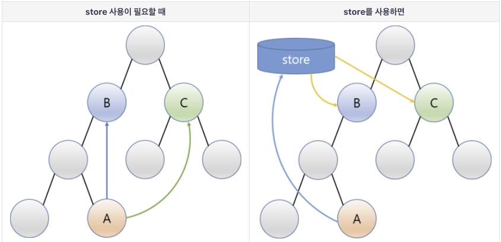

# 3주차 스터디 자료

## svelte-scss template

### how to start

```bash
npx degit neulhan/svelte-scss my-project-name

cd my-project-name

npm i

npm run dev
```

[https://github.com/Neulhan/svelte-scss](https://github.com/Neulhan/svelte-scss)

## SCSS 란?

CSS Preprocessor (CSS 전처리기)
전처리기(SCSS)로 작성하고 컴파일 되어서 CSS로 변환시켜주는 것

SCSS의 문법이나 자세한 내용은 https://medium.com/@jinminkim_50502/css-preprocessor-sass-scss-25dc8329f867

neulhan/svelte-scss를 템플릿으로 생성하면 기본적인 세팅이 완료되어있다

## svelte 프로젝트에서 사용

```scss
<style lang="scss">
  @import "../scss/_definition.scss";
  .container {
    width: 100%;
    min-height: 100%;
    @include custom-flex(center, center);
    p {
      font-size: 124px;
      font-weight: 900;
    }
  }
</style>
```

# study

## 3.1 Each

svelte 에서는 `each` 라는 키워드를 이용해서 반복을 처리한다.

```
{#each foods as food}
    <p>{food}</p>
{/each}
```

## 3.2 if/else

svelte 에서 `if`를 사용하는 방법은 아래와 같다.

```
{#if food.length === 0}
    <p>음식이 존재하지 않습니다.</p>
{/if}
```

svelte 에서 `else/else if`를 사용하는 방법은 아래와 같다.

```
{#each foods as food}
    {#if food === '김치'}
        <div class="food red">{food}</div>
    {:else if food === '블루레몬에이드'}
        <div class="food blue">{food}</div>
    {:else}
        <div class="food">{food}</div>
    {/if}
{/each}
```

## 3.3 store


이미지출처-https://beomy.github.io/tech/svelte/store/

프로젝트가 커질 수록 컴포넌트는 많아지고, 데이터를 props로 계속 밑으로 내리는 방법은 매우 비효율적이게 됩니다.

이를 위해서 svelte 를 포함, 여러 프론트엔드 프레임워크에서는 데이터를 한 곳에 담고, 각각의 컴포넌트에서 해당 하는 장소에서 데이터를 꺼내어 쓰는 방식으로 처리하게 됩니다.

svelte는 store라는 곳에서 데이터를 관리하게 됩니다.

### 실습

store을 만들기 위해 store.js파일을 만듭니다.

`svelte/store` 에서 writable 을 import 해옵니다.

```js
// store.js
import { writable } from "svelte/store";
```

그 다음 writable 함수를 통해서 `초깃값`이 0 인 store를 만들어서,
export 해줍니다.

```js
// store.js
import { writable } from "svelte/store";

export const countStore = writable(0);
```

이제 다른 svelte 파일에서 이 js 파일의 store를 import 할 수 있습니다.

```html
<script>
  import { countStore } from "./store";
  console.log(countStore);
  // {set: ƒ, update: ƒ, subscribe: ƒ}
</script>
```

console 로 찍어보면 `store`는 `set`함수, `update`함수, `subscribe`함수를 가지고 있는 object라는 것을 알 수 있습니다.

`store`에서 값을 꺼내려면 해당 `store`를 구독(subscribe) 하면됩니다.

```html
<script>
  import { countStore } from "./store";

  let count;

  countStore.subscribe((v) => {
    count = v;
  });
</script>
```

해당 스토어를 구독하고 있다가, 해당 스토어에 담긴 값이 변경되면 로컬 변수인 `count`에 해당 값을 담아주는 코드입니다.

`store`에 들어있는 값을 바꿔주는 방법은 `set`함수 와 `update`함수 가 있습니다.

### set 함수

```html
<script>
  import { countStore } from "./store";

  const reset = () => {
    countStore.set(0);
  };
</script>

<button on:click="{reset}">reset count</button>
```

store에 어떤 값이 들어갈지 직접 설정하여 넣어줍니다.

### update 함수

```html
<script>
  import { countStore } from "./store";

  const add = () => {
    countStore.update((v) => v + 1);
  };

  const sub = () => {
    countStore.update((v) => v - 1);
  };
</script>

<button on:click="{add}">+1</button>
<button on:click="{sub}">-1</button>
```

기존에 store에 들어있는 값을 이용해서 새로운 값을 넣어줄 때는 update 를 사용합니다. (콜백을 이용)

### 그 외

store에는 몇가지 writable외에도 readable, custom 등 몇가지 종류가 더 있습니다.

자세한 정보는 아래 블로그에 정말 잘 정리되어 있습니다.
https://beomy.github.io/tech/svelte/store/

## 3.4 store binding

`store`의 값을 꺼내기 위해 `subscribe`를 사용하는 방법을 먼저 알려드렸었습니다.

그런데 사실 svelte 에서는 훨씬 간단한 shortcut을 가지고 있습니다.

```html
<script>
  import { countStore } from "./store";
</script>

<p>{$countStore}</p>
```

위와 같이 store 객체에 `$`를 붙여주면 바로 값을 꺼낼 수 있습니다.

바인딩도 같은 방법으로 합니다.

```html
<script>
  import { countStore } from "./store";
</script>

<p>{$countStore}</p>
<input type="text" bind:value="{$countStore}" />
```

## 3.5 Routing

드디어 SPA(Single Page Application)의 꽃이라고 부를 수 있는 routing 입니다.

기존의 php, jsp, django 등등 html 파일을 직접 렌더링 하거나, 서빙하는 웹서버들은, 페이지가 전환될 때마다 웹페이지를 새로 로드해야하고, 사용자는 새로운 페이지가 로드 되는것을 기다려야만했죠.

분명히 새로운 페이지가 로드될 때까지 하얀 브라우저 화면을 보고 있어야 하는 것은 그리 깔끔한 사용자 경험(UX, User Experience)이 아닙니다.

그러한 사용자 경험을 개선하고자, 등장한 구세주가 바로 SPA(Single Page Application)입니다.

SPA는 페이지 전환을 할 때 페이지 전체를 로드하지 않고, 페이지를 로드할 때 필요한 데이터를 그 때 그 때 서버에서 비동기로 받아옵니다.

사용자는 HTML 전체가 바뀌지 않으니 기본적인 레이아웃을 보면서 자연스럽고 빠른 화면 전환을 경험할 수 있습니다.

### 설치

```bash
npm i svelte-routing
```

### 설정

싱글페이지 옵션을 위해 `-s`옵션을 붙여준다.

```
"scripts": {
  ...
  "start": "sirv public -s"
},
```

### 사용예시

```html
<script>
  import { Router, Link, Route } from "svelte-routing";

  import Zero from "./0.scss.svelte";
  import First from "./1.for.svelte";
  import Second from "./2.if.svelte";
  import Third from "./3.store.svelte";
</script>

<Router>
  <nav>
    <!-- "a" 태그 대신 "Link" 를, "href" 대신 "to"를 사용합니다.  -->
    <Link to="/">HOME</Link>
    <Link to="/first">FIRST</Link>
    <Link to="/second">SECOND</Link>
    <Link to="/third">THIRD</Link>
  </nav>
  <div>
    <!-- "Route"를 통해 어떤 링크가 어떤 컴포넌트를 가리키는지 설정 가능  -->
    <Route path="/">
      <Zero />
    </Route>
    <Route path="/first">
      <First />
    </Route>
    <Route path="/second" component={Second} />
    <Route path="/third" component={Third} />
  </div>
</Router>
```

# 과제

## TODO list 만들기

https://neulhan.github.io/svelte-todo-example/

# 다음주

slot / lifecycle / api request /
